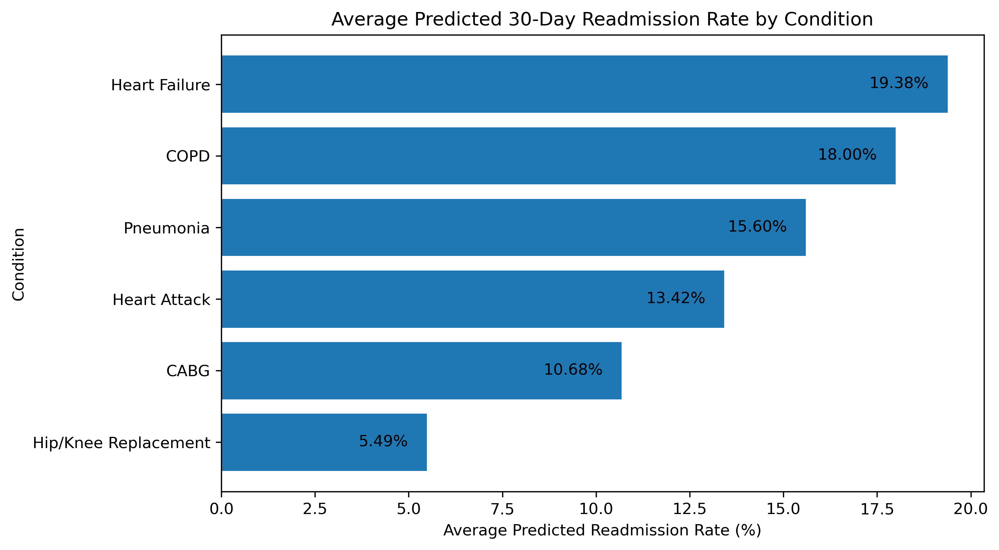
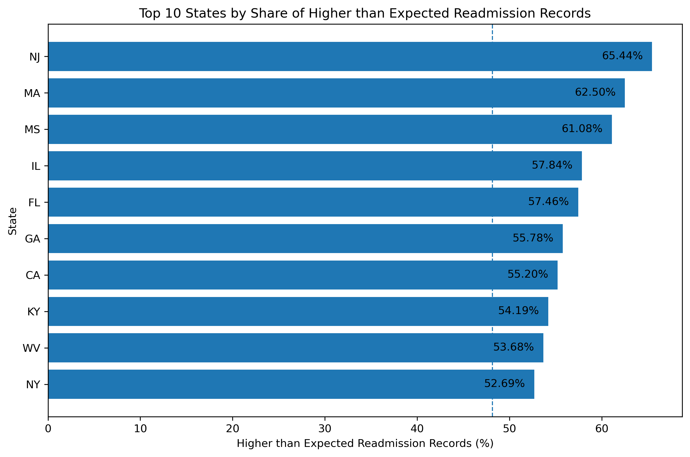
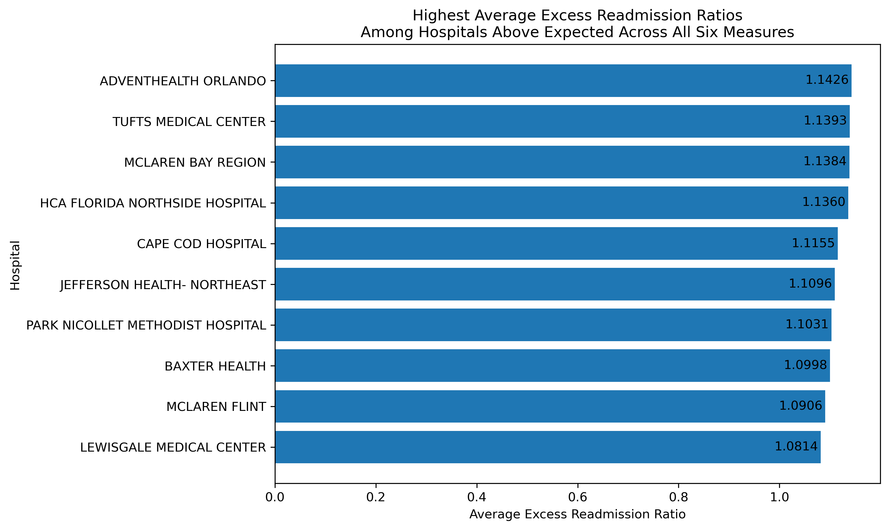

# Hospital Readmissions Analysis

## Overview 

This project analyzes hospital readmission outcomes using data from the Centers for Medicare & Medicaid Services (CMS) Hospital Readmissions Reduction Program (HHRP). The analysis examines how 30-day readmissions outcomes vary across clinical conditions, states, and hospitals, with a focus on identifying patterns in higher-than-expected readmissions.

## Tools

- Python
- Pandas
- NumPy
- Matplotlib
- Jupyter Notebook

## Analysis Questions

1. How do predicted readmission rates vary across HRRP conditions?
2. How do predicted and expected readmission rates compare?
3. What percentage of reported hospital-condition records have higher-than-expected readmissions?
4. How does the prevalence of higher-than-expected readmissions vary across states?
5. Which hospitals show consistently higher-than-expected readmissions across multiple HRRP measures?

## Repository Structure

```text
Hospital-Readmissions-Analysis/
├── data/
│   └── hospital_readmissions.csv
├── images/
│   ├── predicted_readmission_rate_by_condition.png
│   ├── top_10_states_higher_than_expected.png
│   └── top_10_hospitals_excess_readmission_ratio.png
├── hospital_readmissions_analysis.ipynb
└── README.md
```

## Methodology 

### Data Preparation
- Inspected dataset structure, data types, missing values, and reporting patterns.
- Standardized column names and converted identifiers, dates, and numeric fields to appropriate data types.
- Investigated CMS footnote codes and suppressed readmission counts rather than treating unavailable values as zeros.
- Preserved records with unavailable measures in the primary dataset and created filtered datasets for analyses requiring reported readmission metrics.

### Analysis 
- Compared average predicted and expected readmission rates across six HRRP conditions.
- Classified reported hospital-condition records as higher than expected or at/below expected using the CMS excess readmission ratio.
- Compared higher-than-expected readmission patterns across states.
- Aggregated condition-level records to the hospital level and evaluated reporting coverage before comparing facilities.
- Examined hospitals with complete reporting across all six HRRP measures to identify consistently higher-than-expected readmission ratios.

## Key Findings

- **Readmission rates varied substantially by condition.** Heart failure had the highest average predicted 30-day readmission rate at 19.38%, while hip/knee replacement had the lowest at 5.49%.
- **48.15% of reported hospital-condition records had higher-than-expected readmissions.** Among 11,720 records with a reported excess readmission ratio, 5,643 exceeded 1.0.
- **Condition-level differences in higher-than-expected readmissions were relatively small.** Percentages ranged from 46.81% for pneumonia to 49.89% for CABG.
- **State-level patterns showed greater variation.** New Jersey had the highest share of higher-than-expected records at 65.44%, followed by Massachusetts at 62.50% and Mississippi at 61.08%.
- **Consistently elevated ratios across all six measures were uncommon.** Among 647 hospitals with all six HRRP measures reported, 17 hospitals (2.63%) had excess readmission ratios above 1.0 across all six measures. 

## Visualizations

### Predicted Readmission Rates by Condition



Heart failure had the highest average predicted readmission rate, while hip/knee replacement had the lowest.

### Higher-than-Expected Readmissions by State



New Jersey had the highest percentage of reported hospital-condition records with excess readmission ratios above 1.0.

### Hospitals with Consistently Elevated Readmission Ratios


Among hospitals with all six HRRP measures reported, 17 exceeded expected readmission levels across every measure . The chart displays the ten with the highest average excess readmission ratios. 

## Data Source

Data for this project comes from the Centers for Medicare & Medicaid Services (CMS) Hospital Readmissions Reduction Program (HRRP) dataset available though the CMS Provider Data Catalog.

[CMS Hospital Readmissions Reduction Program Dataset](https://data.cms.gov/provider-data/dataset/9n3s-kdb3)

The dataset contains hospital-level 30-day readmission measures for six conditions and procedures included in the HRRP.

## Limitations
- CMS reporting rules result in suppressed or unavailable values for some hospital-condition records, so not every hospital has complete data across all six HRRP measures.
- Hospital and state comparisons are based only on reported HRRP measures and should not be interpreted as an overall assessment of hospital quality.
- Differences in patient populations, clinical conditions, hospital characteristics, and reporting coverage may contribute to observed variation.
- State-level results do not adjust for differences in the number of mix of reporting hospitals and conditions across states.
- This analysis is descriptive and identifies patterns in the CMS data; it does not establish causes of higher or lower readmission outcomes.
